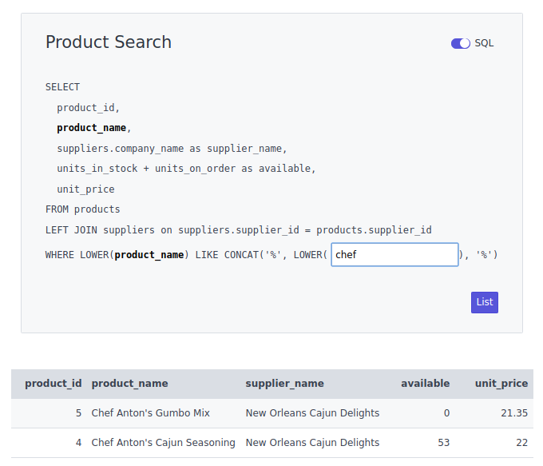
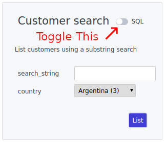

# Esqlate

## Project Purpose

Esqlate is an attempt to give small teams a quick and easy form of administration panel which is significantly more powerful than CRUD based systems but also as easy to set up.

## What problem is it solving?

A lot of my work history has been based at small companies companies with small teams where there is enough resource to build a impressive product using great code and give users a great user experience, but it is sometimes difficult to justify investing as much time into creating administration panels which nobody other than internal employees will ever see.

There are many times I have had to delve into the database because the narrow range of operations which are available on the administration panels does not cover what I, at that moment need to do.  I don't think this is always a problem, particularly when the project is at a very early stage but as a project grows the having developers or systems administrators log into the database and change settings has some real downsides:

 * You're taking time from developers / systems administrators to do things which could be done by less technical employees.
 * Executing database operations is nearly always a bespoke operation on live data, meaning we have to be really, really careful and think things through in great detail.
 * Eventually, everyone will make a mistake, while logged into a live database the unintended effect could be disastrous.

## What is it?

Esqlate interprets a simple JSON file like the below:

```json
{
  "name": "product_search",
  "title": "Product Search",
  "description": "List products that include a substring",
  "parameters": [
    {
      "name": "product_name",
      "type": "string"
    }
  ],
  "statement": "\
    SELECT\n\
      product_id,\n\
      product_name,\n\
      suppliers.company_name as supplier_name,\n\
      unit_price\n\
    FROM products\n\
    LEFT JOIN suppliers on suppliers.supplier_id = products.supplier_id\n\
    WHERE LOWER(product_name) LIKE CONCAT('%', LOWER($product_name), '%')"
}
```

Into a fairly usable and reasonable web interface shown below:



If users are of a nervous disposition and scared off by seeing things they don't understand (like SQL) they can flip the toggle to convert the query based interface into a simple form.



We can specify parameters as strings, dates, datetimes, integers, selects, decimals and even use a popup to allow rich selection of a specific parameter:


Another powerful feature is to provide the user the ability to link these simple JSON documents together together. Doing this giving many possible journeys allowing meaningful self-service administration.

;

## What still needs to be done?
